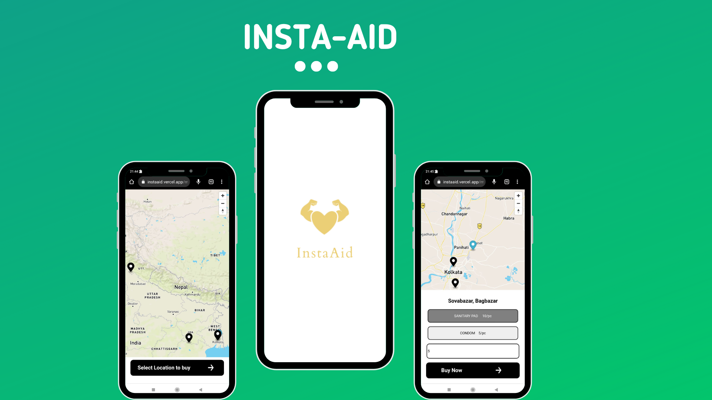

# INSTA-AID

{width=50%}


## Tech Stack Used:

* For the development of this project, the following Technology Stack has been used:

    ### Frontend:
    - **React.js, HTML, CSS** for UI/UX of the application.
    - **Mapbox** for providing maps and location. 

    ### Backend:
    - **Node.js** for core functionality.
    - **Prisma** as database store.
    - **Cashfree** as Payment Gateway.

## Usage:

* The application is deployed in vercel <a href="https://instaaid.vercel.app/">here</a>.
* Full usage documentation is provided <a href="">here</a>.

## Development & Deployment:

* For development purposes follow the next steps to run and build the application:
* Clone the *backend* and *frontend* repositories first:

```bash
git clone "https://github.com/CrazyDev2-0/clientv2"
git clone "https://github.com/CrazyDev2-0/backend"
```
* Next, start the frontend with:
```bash
cd frontend
npm install --force
npm run start
```
* Start the backend with:
```bash
cd ../backend
npm install
npm run dbMigrate
npm run start
```
* Finally setup your API keys with: renaming .env-example to .env and filling all the keys appropriately.
* Navigate to http://localhost:3000 in your browser to check the working application.
# instaaid
# instaaid
# instaaid
